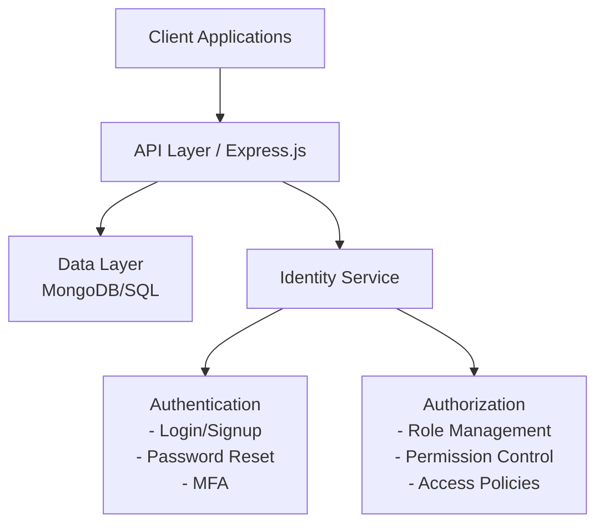

# User Identity and Authorization Management System Design Document

## 1. System Overview

This document outlines the design for a user identity and authorization management system built on Node.js for the Custom Build Platform. The system will provide secure user authentication, role-based access control, and session management.

## 2. Architecture

### 2.1 High-Level Architecture



### 2.2 Component Interactions

- **Client Applications**: Web/mobile frontends that consume the authentication API
- **API Layer**: Express.js REST API handling user requests
- **Identity Service**: Core service managing user identities
- **Authentication**: Handles verification of user credentials
- **Authorization**: Manages permissions and access control
- **Data Layer**: Stores user data, credentials, and permissions

## 3. Data Models

### 3.1 User Schema

```javascript
{
  id: String,                    // Unique identifier
  username: String,              // Username for login
  email: String,                 // Email address (verified status tracked separately)
  passwordHash: String,          // Bcrypt hashed password
  salt: String,                  // Password salt
  profile: {
    firstName: String,
    lastName: String,
    avatar: String,              // URL to avatar image
    phoneNumber: String,         // Optional
  },
  mfaEnabled: Boolean,           // Multi-factor authentication flag
  mfaMethod: String,             // "app", "sms", etc.
  mfaSecret: String,             // Encrypted secret for MFA
  created: Date,                 // Account creation timestamp
  lastLogin: Date,               // Last successful login
  status: String,                // "active", "suspended", "pending"
  failedLoginAttempts: Number,   // Track failed attempts for account lockout
  passwordResetToken: String,    // For password reset functionality
  passwordResetExpiry: Date      // Expiration for reset token
}
```

### 3.2 Role Schema

```javascript
{
  id: String,                    // Unique identifier
  name: String,                  // Role name (e.g., "admin", "user")
  description: String,           // Description of the role
  permissions: [String],         // Array of permission identifiers
  created: Date,                 // Creation timestamp
  updated: Date                  // Last update timestamp
}
```

### 3.3 Permission Schema

```javascript
{
  id: String,                    // Unique identifier
  resource: String,              // Resource being accessed
  action: String,                // Action being performed (read, write, delete)
  description: String            // Human-readable description
}
```

### 3.4 UserRole Mapping

```javascript
{
  userId: String,                // Reference to user
  roleId: String,                // Reference to role
  assignedBy: String,            // User who assigned the role
  assignedAt: Date               // When role was assigned
}
```

### 3.5 Session Schema

```javascript
{
  id: String,                    // Session identifier
  userId: String,                // Reference to user
  token: String,                 // JWT or session token
  ipAddress: String,             // IP address used for session
  userAgent: String,             // User agent information
  created: Date,                 // Session creation time
  expires: Date,                 // Session expiry time
  lastActive: Date               // Last activity timestamp
}
```

## 4. Authentication Flows

### 4.1 Registration Flow

1. Client submits registration data (username, email, password)
2. Server validates input data
3. Check for existing users with same username/email
4. Hash password using bcrypt with unique salt
5. Create new user record with status "pending"
6. Generate email verification token
7. Send verification email
8. Return success response

### 4.2 Login Flow

1. User submits credentials (username/email + password)
2. Validate credentials format
3. Look up user by username/email
4. Compare password hash
5. If MFA enabled, request second factor
6. Issue JWT token with appropriate claims
7. Record login timestamp and session info
8. Return token and user info (excluding sensitive data)

### 4.3 Multi-Factor Authentication Flow

1. After successful password verification, check if MFA is enabled
2. Depending on MFA method:
   - TOTP App: Request time-based code from user
   - SMS: Send code to registered phone number
   - Email: Send code to registered email
3. Validate submitted code
4. Proceed with session creation if validated

### 4.4 Password Reset Flow

1. User requests password reset with email address
2. System generates unique time-limited token
3. Send reset link with token to user's email
4. User follows link and submits new password
5. Verify token validity and expiration
6. Update password hash and clear reset token
7. Invalidate existing sessions (optional)
8. Notify user of successful password change

## 5. Authorization Mechanisms

### 5.1 Role-Based Access Control (RBAC)

- Users are assigned one or more roles
- Roles contain collections of permissions
- Permissions define allowed actions on specific resources
- API endpoints validate permissions before processing requests

### 5.2 Permission Checking

```javascript
// Example permission middleware
const checkPermission = (requiredPermission) => {
  return async (req, res, next) => {
    const user = req.user;  // From JWT token
    
    // Get user roles and associated permissions
    const userPermissions = await getUserPermissions(user.id);
    
    if (userPermissions.includes(requiredPermission)) {
      next();
    } else {
      res.status(403).json({ error: 'Permission denied' });
    }
  };
};

// Usage on routes
app.get('/api/admin/users', 
  authenticate, 
  checkPermission('users:read'), 
  userController.listUsers
);
```

### 5.3 JWT Structure

```javascript
{
  "header": {
    "alg": "RS256",
    "typ": "JWT"
  },
  "payload": {
    "sub": "user_id_123",
    "name": "John Doe",
    "email": "john@example.com",
    "roles": ["user", "project_admin"],
    "iat": 1625036961,
    "exp": 1625123361
  },
  "signature": "..."
}
```

## 6. API Endpoints

### 6.1 Authentication Endpoints

- `POST /api/auth/register` - User registration
- `POST /api/auth/verify-email` - Email verification
- `POST /api/auth/login` - User login
- `POST /api/auth/logout` - User logout
- `POST /api/auth/refresh-token` - Refresh access token
- `POST /api/auth/forgot-password` - Request password reset
- `POST /api/auth/reset-password` - Process password reset
- `POST /api/auth/mfa/setup` - Set up MFA
- `POST /api/auth/mfa/verify` - Verify MFA during login

### 6.2 User Management Endpoints

- `GET /api/users/me` - Get current user profile
- `PUT /api/users/me` - Update current user profile
- `PUT /api/users/me/password` - Change password
- `GET /api/users` - List users (admin)
- `GET /api/users/:id` - Get user details (admin)
- `PUT /api/users/:id` - Update user (admin)
- `DELETE /api/users/:id` - Delete user (admin)

### 6.3 Role & Permission Management

- `GET /api/roles` - List all roles
- `POST /api/roles` - Create new role
- `GET /api/roles/:id` - Get role details
- `PUT /api/roles/:id` - Update role
- `DELETE /api/roles/:id` - Delete role
- `GET /api/permissions` - List all permissions
- `POST /api/users/:id/roles` - Assign role to user
- `DELETE /api/users/:id/roles/:roleId` - Remove role from user

## 7. Security Considerations

### 7.1 Password Storage

- Use bcrypt for password hashing with work factor of 12+
- Generate unique salt for each user
- Never store plain text passwords
- Implement password strength requirements

### 7.2 Token Security

- Use signed JWTs with RS256 algorithm
- Keep token lifetime short (15-60 minutes)
- Implement refresh token rotation
- Store token fingerprints in the database for revocation

### 7.3 Rate Limiting

- Implement rate limiting on authentication endpoints
- Account lockout after multiple failed attempts
- Progressive delays for repeated failed attempts

### 7.4 Secure Headers

```javascript
// Example security headers middleware
app.use((req, res, next) => {
  res.setHeader('X-Content-Type-Options', 'nosniff');
  res.setHeader('X-Frame-Options', 'DENY');
  res.setHeader('X-XSS-Protection', '1; mode=block');
  res.setHeader('Strict-Transport-Security', 'max-age=31536000; includeSubDomains');
  res.setHeader('Content-Security-Policy', "default-src 'self'");
  next();
});
```

## 8. Technology Stack

- **Backend Framework**: Express.js on Node.js
- **Database**: MongoDB (or PostgreSQL with Sequelize)
- **Authentication**: Passport.js, JWT
- **Password Hashing**: bcrypt
- **MFA**: node-2fa or speakeasy
- **Validation**: Joi or express-validator
- **Email Service**: Nodemailer with SMTP or third-party service
- **Logging**: Winston or Bunyan

## 9. Implementation Guidelines

### 9.1 Project Structure

```bash
/src
  /api
    /controllers
      authController.js
      userController.js
      roleController.js
    /middlewares
      authenticate.js
      authorize.js
      validateRequest.js
    /routes
      authRoutes.js
      userRoutes.js
      roleRoutes.js
  /services
    authService.js
    userService.js
    roleService.js
    emailService.js
  /models
    User.js
    Role.js
    Permission.js
    Session.js
  /utils
    passwordUtils.js
    tokenUtils.js
    validators.js
  /config
    index.js
    database.js
  app.js
  server.js
```

### 9.2 Environment Configuration

```env
# .env example
NODE_ENV=development
PORT=3000
DB_URI=mongodb://localhost:27017/authdb
JWT_SECRET=your-secret-key
JWT_EXPIRES_IN=1h
REFRESH_TOKEN_EXPIRES_IN=7d
PASSWORD_RESET_EXPIRES_IN=1h
EMAIL_FROM=noreply@example.com
SMTP_HOST=smtp.example.com
SMTP_PORT=587
SMTP_USER=user
SMTP_PASS=password
```

## 10. Testing Strategy

### 10.1 Unit Tests

- Test individual components in isolation
- Mock dependencies
- Focus on business logic and edge cases

### 10.2 Integration Tests

- Test API endpoints with actual database operations
- Verify authentication and authorization flows
- Test token generation and validation

### 10.3 Security Testing

- Password hashing verification
- Token security tests
- Rate limiting tests
- Session management tests
- Input validation and sanitation tests

## 11. Deployment and Scaling

### 11.1 Containerization

- Use Docker for containerization
- Docker Compose for development environment
- Kubernetes for production deployment

### 11.2 Monitoring

- Implement health check endpoints
- Track authentication failures and suspicious activities
- Monitor session counts and database performance
- Set up alerts for security events

## 12. Future Enhancements

- OAuth2/OIDC provider integration
- SAML federation
- Hardware security key support
- Session management UI
- Advanced audit logging
- Risk-based authentication
