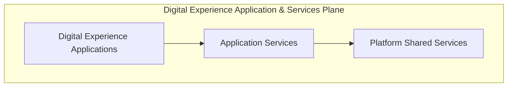
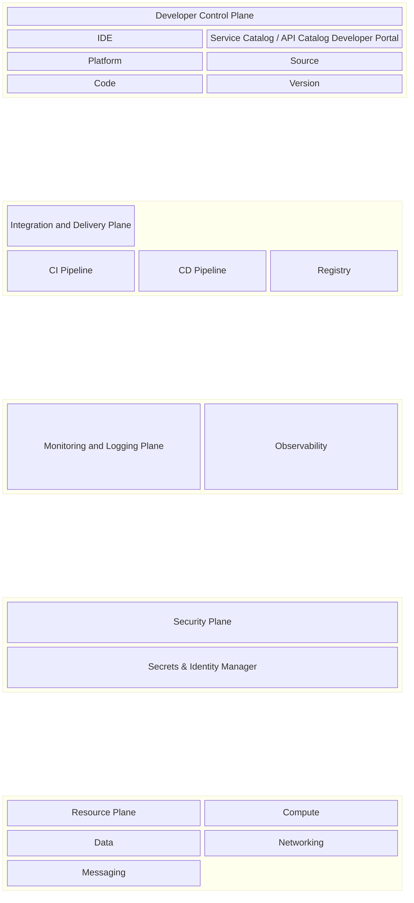

# Custom Build Platform Architecture

## 1. Introduction

### Purpose of the document

This document provides a comprehensive overview of the Custom Build Platform's architecture, serving as a foundational guide for stakeholders—including developers, architects, and project managers—to understand its design principles, core components, and operational strategies.

### High-Level Description of the Platform

The Custom Build Platform is a comprehensive solution designed to streamline the development and deployment of custom-built applications and services. It provides a modular and scalable framework that supports seamless integration with external systems and ensures high performance, reliability, and security. The platform is tailored to meet the diverse needs of developers, architects, and stakeholders by offering intuitive tools and services that enhance productivity and collaboration.

Key features include:

- A robust architecture that facilitates efficient data flow and interoperability.
- A technology stack leveraging modern programming languages, frameworks, and infrastructure tools to deliver state-of-the-art solutions.
- Built-in scalability and security measures to handle evolving demands and protect sensitive data.

### Key Objectives and Guiding Principles

- **Key Objectives**:
  - Deliver a robust and scalable platform for custom build application.
  - Ensure seamless integration with external systems and services.
  - Provide a user-friendly interface for developers and stakeholders.
  - Optimize performance and reliability across all components.

- **Guiding Principles**:
  - Business Guiding Principles:
    - Customer Focus: Prioritize the needs and expectations of end-users to deliver value-driven solutions.
    - Innovation: Foster a culture of creativity and continuous improvement to stay ahead in the market.
    - Collaboration: Encourage teamwork and open communication among stakeholders to achieve shared goals.
    - Efficiency: Optimize processes and resource utilization to maximize productivity and minimize waste.
    - User-Centric Design: Focus on delivering value and usability for end-users.
    - Business Agility: Adapt quickly to changing market conditions and customer needs through flexible processes and decision-making.
    - Cost Optimization: Design and operate the platform to maximize value while minimizing costs.
  - Technology Guiding Principles
    - Modularity: Design components to be independent and reusable.
    - Scalability: Ensure the platform can handle increasing workloads efficiently.
    - Security: Implement strong security measures to protect data and systems.
    - Resiliency: Ensure the platform can recover quickly from failures and maintain continuous operation.
    - Maintainability: Facilitate easy updates and enhancements to the platform.
    - Interoperability: Support integration with diverse tools and technologies.

### Implementation through Key Strategies

1. Cloud-Native and Containerized Strategy
2. Microservices Architecture Strategy
3. Integration and API Strategy
4. Well-Architected Framework

## 2. High-Level Architecture Overview

### Visual Overview

```mermaid
block-beta
  block
    columns 3
    ControlPlane["Control Plane"]:3
    A["Admin User Management"]
    T["Tenant Management"]
    AP["Application Management"]
  end
  block
    columns 1
    Apps["Custom Build Digital Experience Application and Services Plane"]:3
    DXA["Digital Experience Applications"]
    AS["Application Services"]
    PS["Platform Services"]
  end
  block
    columns 1
    DEV["Developer Plane"]
  end
````

The overall architecture will be broken down into:

### Custom Build Platform Control Plane

```mermaid
block-beta
  block
  columns 3
    A["Admin User Management"]
    T["Tenant Management"]
    AP["Application Management"]
  end
```

The Platform Control Plane is responsible for managing and orchestrating the overall operation of the Custom Build Platform. It serves as the central hub for configuration, governance, and monitoring, ensuring that all components of the platform function cohesively.

Features include:

  1. Admin User Management
  2. Tenant Management
  3. Application Management

### Custom Build Digital Experience Application and Services Plane



The Custom Build Digital Experience Application and Services Plane is the layer where digital applications and services are implemented using a microservices architecture and API-driven approach.

This plane is divided into three categories:

1. **Digital Experience Applications**: All application with user interfaces will be placed here

2. **Application Services**: These are services specific to individual applications, tailored to meet the unique requirements of each digital experience.

   Examples include:
    - Business logic and workflows specific to the application.
    - APIs that expose application-specific functionality to external systems.

3. **Platform (Shared) Services**: These are reusable services shared across multiple applications, designed to provide foundational capabilities and ensure consistency.

   Examples include:
     - Identity and access management.
     - API gateway and integration services.
     - Observability and monitoring tools.
     - Security and compliance mechanisms.
     - Data storage and analytics services.

This plane is designed to be modular, scalable, and extensible, enabling seamless integration with external systems while ensuring high performance and reliability. Developers can leverage well-documented APIs, SDKs, and integration tools to build and deploy applications efficiently. The architecture supports interoperability, allowing applications to connect with diverse tools and technologies while maintaining adaptability to evolving requirements.

### Developer Plane



The Developer Plane is designed to empower developers with the tools, resources, and environments necessary to build, test, and deploy applications efficiently. It serves as the foundation for developer productivity and collaboration, ensuring that teams can focus on delivering high-quality solutions.

Key features include:

1. **Development Environments**:

   - Pre-configured environments for coding, debugging, and testing.
   - Support for local development setups and cloud-based environments.
   - Integration with popular IDEs and code editors.

2. **Build and Deployment Tools**:

   - CI/CD pipelines to automate build, test, and deployment processes.
   - Containerization tools (e.g., Docker) for consistent application packaging.
   - Orchestration platforms (e.g., Kubernetes) for managing deployments.

3. **Developer Portals and Documentation**:

   - Centralized portal for accessing APIs, SDKs, and integration guides.
   - Comprehensive documentation for platform services and features.
   - Tutorials, examples, and best practices to accelerate development.

4. **Collaboration and Version Control**:

   - Integration with version control systems (e.g., Git) for code management.
   - Tools for team collaboration, such as issue tracking and code reviews.
   - Support for branching strategies and release workflows.

5. **Testing and Quality Assurance**:

   - Automated testing frameworks for unit, integration, and end-to-end tests.
   - Tools for performance testing and security validation.
   - Staging environments that mirror production for realistic testing scenarios.

6. **Monitoring and Feedback**:

   - Real-time monitoring tools to track application performance during development.
   - Feedback loops to gather insights from users and stakeholders.
   - Analytics dashboards to measure key metrics and identify areas for improvement.

The Developer Plane is designed to be intuitive and developer-friendly, enabling teams to work efficiently while maintaining high standards of quality and security. By providing robust tools and resources, the platform fosters innovation and collaboration, ensuring that developers can deliver impactful solutions that meet business objectives.

## 7. Technology Stack

The platform leverages a modern, modular technology stack to ensure scalability, maintainability, and developer productivity.

- **Languages & Frameworks**:  
  - Node.js (Express.js), .NET, Java, Python, Go
- **Frontend**:  
  - React, Angular, or Vue.js (for digital experience applications)
- **Databases**:  
  - MongoDB (primary NoSQL), PostgreSQL (relational), Redis (caching/session)
- **API & Integration**:  
  - RESTful APIs, GraphQL, OpenAPI/Swagger for documentation
- **Authentication & Authorization**:  
  - OAuth2, JWT, SAML, OpenID Connect
- **DevOps & CI/CD**:  
  - GitHub Actions, Docker, Kubernetes, Helm, pm2
- **Testing & Quality**:  
  - Jest, Mocha, Supertest (Node.js), xUnit (.NET), JUnit (Java), Pytest (Python)
- **Monitoring & Logging**:  
  - Prometheus, Grafana, ELK Stack, Winston, Morgan
- **Messaging & Eventing**:  
  - RabbitMQ, Kafka
- **Other Tools**:  
  - ESLint, Prettier, dotenv, nodemon, Swagger UI, Joi, Lodash, Moment/date-fns
