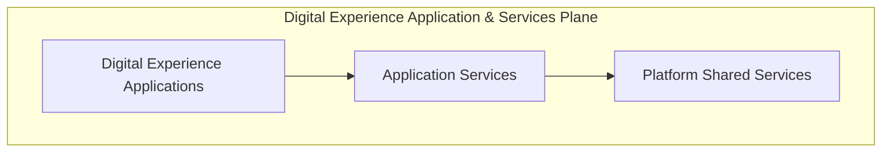
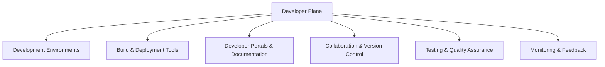

# Custom Build Platform Architecture

## 1. Introduction

### Purpose of the document

This document provides a comprehensive overview of the Custom Build Platform's architecture, serving as a foundational guide for stakeholders—including developers, architects, and project managers—to understand its design principles, core components, and operational strategies.

### High-Level Description of the Platform

The Custom Build Platform is a comprehensive solution designed to streamline the development and deployment of custom-built applications and services. It provides a modular and scalable framework that supports seamless integration with external systems and ensures high performance, reliability, and security. The platform is tailored to meet the diverse needs of developers, architects, and stakeholders by offering intuitive tools and services that enhance productivity and collaboration.

Key features include:

- A robust architecture that facilitates efficient data flow and interoperability.
- Comprehensive service categories that address core operational needs, such as identity management, API integration, DevOps automation, and observability.
- A technology stack leveraging modern programming languages, frameworks, and infrastructure tools to deliver state-of-the-art solutions.
- Built-in scalability and security measures to handle evolving demands and protect sensitive data.

### Key Objectives and Guiding Principles

- **Key Objectives**:
  - Deliver a robust and scalable platform for custom build application.
  - Ensure seamless integration with external systems and services.
  - Provide a user-friendly interface for developers and stakeholders.
  - Optimize performance and reliability across all components.

- **Business Guiding Principles**:
  - **Customer Focus**: Prioritize the needs and expectations of end-users to deliver value-driven solutions.
  - **Innovation**: Foster a culture of creativity and continuous improvement to stay ahead in the market.
  - **Collaboration**: Encourage teamwork and open communication among stakeholders to achieve shared goals.
  - **Efficiency**: Optimize processes and resource utilization to maximize productivity and minimize waste. This includes:
  - **User-Centric Design**: Focus on delivering value and usability for end-users.
  - **Business Agility**: Adapt quickly to changing market conditions and customer needs through flexible processes and decision-making. This includes:
    - Designing processes and systems that support quick iteration and deployment of new features.
    - Encouraging a flexible and responsive culture that embraces change and continuous improvement.
    - Empowering teams to make data-driven decisions and pivot strategies as needed.
    - Implementing modular and loosely coupled architectures to enable independent updates and scaling.
    - Leveraging automation and DevOps practices to reduce time-to-market and increase operational efficiency.
    - Continuously gathering feedback from users and stakeholders to inform product direction and priorities.
  - **Cost Optimized**: Design and operate the platform to maximize value while minimizing costs. This includes:
    - Leveraging auto-scaling and serverless technologies to match resource usage with demand.
    - Utilizing managed services and open-source solutions where appropriate to reduce operational overhead.
    - Implementing multi-tenancy to share resources efficiently across customers.
    - Continuously monitoring and analyzing cloud and infrastructure spend to identify optimization opportunities.
    - Automating the shutdown of non-production environments when not in use.
    - Regularly reviewing and right-sizing compute, storage, and network resources.
    - Promoting a culture of cost awareness and accountability among engineering teams.

- **Technical Guiding Principles**: The architecture of the Custom Build Platform is guided by several core principles to ensure a robust, scalable, and maintainable system:
  - **Modularity**: Design components to be independent and reusable. The platform will be composed of independent, reusable components that can be developed, tested, and deployed separately. This approach enables easier maintenance, faster development cycles, and the flexibility to upgrade or replace individual modules without impacting the entire system.
  - **Scalability**: Ensure the platform can handle increasing workloads efficiently. The system is designed to efficiently handle increasing workloads by supporting horizontal and vertical scaling. Services can be distributed across multiple nodes, and resources can be dynamically allocated to meet demand, ensuring consistent performance as usage grows.
  - **Security**: Implement strong security measures to protect data and systems. Security is integrated at every layer of the platform, including strong authentication and authorization mechanisms, data encryption in transit and at rest, and regular security audits. The platform adheres to industry best practices and compliance standards to protect sensitive data and prevent unauthorized access.
  - **Resiliency**: Ensure the platform can recover quickly from failures and maintain continuous operation. Resiliency is achieved through strategies such as redundancy, failover mechanisms, and automated recovery processes. The platform is designed to handle unexpected disruptions gracefully, minimizing downtime and impact on users. This include:
    - Implementing multi-region deployments to ensure availability during regional outages.
    - Utilizing distributed systems and replication to safeguard data integrity.
    - Monitoring system health and performance to detect and address issues proactively.
    - Designing services with fault tolerance and self-healing capabilities.
    - Conducting regular disaster recovery drills to validate recovery procedures.
    - Leveraging load balancing to distribute traffic and prevent bottlenecks.
    - Ensuring critical components have backup systems and failover configurations.
  - **Maintainability**: Facilitate easy updates and enhancements to the platform. The codebase and infrastructure are structured to facilitate easy updates, debugging, and enhancements. Clear documentation, automated testing, and standardized development practices help ensure that the platform remains reliable and adaptable to changing requirements.
  - **Interoperability**: Support integration with diverse tools and technologies. The platform is designed to seamlessly connect with a wide range of third-party systems, services, and protocols, enabling users and partners to leverage existing investments and accelerate solution delivery. For example, a partner can integrate their CRM system with the platform using REST APIs to automate customer onboarding, or a customer can connect their on-premises data warehouse via standardized connectors to enable real-time analytics. This includes:
    - Providing well-documented APIs such as REST and GraphQL, and webhooks for external integrations.
    - Supporting industry-standard authentication and authorization mechanisms (OAuth2, SAML, OpenID Connect).
    - Ensuring compatibility with popular CI/CD, monitoring, and DevOps tools.
    - Enabling data exchange through standardized formats (JSON, XML, CSV) and protocols.
    - Facilitating integration with both cloud-native and on-premises systems.
    - Maintaining clear versioning and backward compatibility for APIs to minimize integration disruptions.
    - Offering SDKs and client libraries in multiple programming languages (such as Python, JavaScript/TypeScript, Java, and Go) to accelerate partner and customer adoption.

### Implementation through Key Strategies

1. Cloud-Native and Containerized Strategy
2. Microservices Architecture Strategy
3. Integration and API Strategy
4. Well-Architected Framework

## 2. High-Level Architecture Overview

### Visual Overview

```mermaid
flowchart TD
    CP[Control Plane]
    DEV[Developer Plane]
    DXA[Digital Experience Applications]
    AS[Application Services]
    PS[Platform Services]

    subgraph Digital Experience Application & Services Plane
        DXA --> AS
        DXA --> PS
        AS --> PS
    end
````

The overall architecture will be broken down into:

### Custom Build Platform Control Plane

```mermaid
flowchart TD
    A[Admin User Management]
    T[Tenant Management]
    AP[Application Management]
    CP[Control Plane]

    CP --> A
    CP --> T
    CP --> AP
```

The Platform Control Plane is responsible for managing and orchestrating the overall operation of the Custom Build Platform. It serves as the central hub for configuration, governance, and monitoring, ensuring that all components of the platform function cohesively.

Features include:

  1. Admin User Management
  2. Tenant Management
  3. Application Management

### Custom Build Digital Experience Application and Services Plane



The Custom Build Digital Experience Application and Services Plane is the layer where digital applications and services are implemented using a microservices architecture and API-driven approach.

This plane is divided into three categories:

1. **Digital Experience Applications**: All application with user interfaces will be placed here

2. **Application Services**: These are services specific to individual applications, tailored to meet the unique requirements of each digital experience.

   Examples include:
    - Business logic and workflows specific to the application.
    - APIs that expose application-specific functionality to external systems.

3. **Platform (Shared) Services**: These are reusable services shared across multiple applications, designed to provide foundational capabilities and ensure consistency.

   Examples include:
     - Identity and access management.
     - API gateway and integration services.
     - Observability and monitoring tools.
     - Security and compliance mechanisms.
     - Data storage and analytics services.

This plane is designed to be modular, scalable, and extensible, enabling seamless integration with external systems while ensuring high performance and reliability. Developers can leverage well-documented APIs, SDKs, and integration tools to build and deploy applications efficiently. The architecture supports interoperability, allowing applications to connect with diverse tools and technologies while maintaining adaptability to evolving requirements.

### Developer Plane



The Developer Plane is designed to empower developers with the tools, resources, and environments necessary to build, test, and deploy applications efficiently. It serves as the foundation for developer productivity and collaboration, ensuring that teams can focus on delivering high-quality solutions.

Key features include:

1. **Development Environments**:

   - Pre-configured environments for coding, debugging, and testing.
   - Support for local development setups and cloud-based environments.
   - Integration with popular IDEs and code editors.

2. **Build and Deployment Tools**:

   - CI/CD pipelines to automate build, test, and deployment processes.
   - Containerization tools (e.g., Docker) for consistent application packaging.
   - Orchestration platforms (e.g., Kubernetes) for managing deployments.

3. **Developer Portals and Documentation**:

   - Centralized portal for accessing APIs, SDKs, and integration guides.
   - Comprehensive documentation for platform services and features.
   - Tutorials, examples, and best practices to accelerate development.

4. **Collaboration and Version Control**:

   - Integration with version control systems (e.g., Git) for code management.
   - Tools for team collaboration, such as issue tracking and code reviews.
   - Support for branching strategies and release workflows.

5. **Testing and Quality Assurance**:

   - Automated testing frameworks for unit, integration, and end-to-end tests.
   - Tools for performance testing and security validation.
   - Staging environments that mirror production for realistic testing scenarios.

6. **Monitoring and Feedback**:

   - Real-time monitoring tools to track application performance during development.
   - Feedback loops to gather insights from users and stakeholders.
   - Analytics dashboards to measure key metrics and identify areas for improvement.

The Developer Plane is designed to be intuitive and developer-friendly, enabling teams to work efficiently while maintaining high standards of quality and security. By providing robust tools and resources, the platform fosters innovation and collaboration, ensuring that developers can deliver impactful solutions that meet business objectives.

## 7. Technology Stack

The platform leverages a modern, modular technology stack to ensure scalability, maintainability, and developer productivity.

- **Languages & Frameworks**:  
  - Node.js (Express.js), .NET, Java, Python, Go
- **Frontend**:  
  - React, Angular, or Vue.js (for digital experience applications)
- **Databases**:  
  - MongoDB (primary NoSQL), PostgreSQL (relational), Redis (caching/session)
- **API & Integration**:  
  - RESTful APIs, GraphQL, OpenAPI/Swagger for documentation
- **Authentication & Authorization**:  
  - OAuth2, JWT, SAML, OpenID Connect
- **DevOps & CI/CD**:  
  - GitHub Actions, Docker, Kubernetes, Helm, pm2
- **Testing & Quality**:  
  - Jest, Mocha, Supertest (Node.js), xUnit (.NET), JUnit (Java), Pytest (Python)
- **Monitoring & Logging**:  
  - Prometheus, Grafana, ELK Stack, Winston, Morgan
- **Messaging & Eventing**:  
  - RabbitMQ, Kafka
- **Other Tools**:  
  - ESLint, Prettier, dotenv, nodemon, Swagger UI, Joi, Lodash, Moment/date-fns

## 8. Data Flow & Integration

The platform supports multiple integration patterns to enable seamless data exchange and interoperability:

- **Integration Approaches**:
  - **APIs**: RESTful and GraphQL APIs for synchronous communication.
  - **Event-Driven Architecture**: Kafka or RabbitMQ for asynchronous messaging and decoupled services.
  - **Enterprise Service Bus (ESB)**: For orchestrating complex integrations with external systems.
- **Data Flow**:
  - Data flows between digital experience applications, application services, and platform services via secure APIs and message queues.
  - External systems integrate through well-documented APIs or event streams.
- **Integration Points**:
  - Third-party authentication providers, external data sources, partner APIs, and cloud services.

## 9. Security Considerations

Security is embedded at every layer of the platform:

- **Authentication & Authorization**: OAuth2, JWT, SAML, and role-based access control.
- **Data Protection**: Encryption in transit (TLS/SSL) and at rest; secure storage of secrets using vaults or environment variables.
- **Compliance**: Adherence to GDPR, SOC2, and other relevant standards.
- **Vulnerability Management**: Regular dependency scanning, static code analysis, and penetration testing.
- **API Security**: Input validation (Joi), rate limiting, CORS, and secure HTTP headers (Helmet).

## 10. Scalability & Reliability

The platform is designed for high availability and elastic scalability:

- **Horizontal Scaling**: Services are stateless and can be scaled out across multiple nodes.
- **Load Balancing**: Managed via Kubernetes and cloud-native load balancers.
- **Auto-Scaling**: Dynamic resource allocation based on demand.
- **Resiliency**: Circuit breakers, retries, and fallback mechanisms.
- **Disaster Recovery**: Multi-region deployments, automated backups, and failover strategies.

## 11. Deployment & Operations

Modern DevOps practices ensure rapid, reliable delivery:

- **CI/CD Pipelines**: Automated build, test, and deployment using GitHub Actions.
- **Containerization**: All services are packaged as Docker containers.
- **Orchestration**: Kubernetes manages deployment, scaling, and health of containers.
- **Monitoring & Logging**: Centralized logging (ELK), metrics (Prometheus), and dashboards (Grafana).
- **Environment Management**: Use of environment variables and secrets management for configuration.

## 12. Future Enhancements

- Expand support for additional programming languages and frameworks.
- Integrate AI/ML services for advanced analytics and automation.
- Enhance self-service capabilities in the developer portal.
- Implement advanced cost optimization and resource governance features.
- Strengthen zero-trust security and compliance automation.
- Continuous improvement based on user and stakeholder feedback.

## 13. References

- [Project README](../../README.md)
- [API Documentation (OpenAPI/Swagger)](../api/openapi.yaml)
- [Developer Portal](../developer-portal/)
- [CI/CD Pipeline Configurations](../../.github/workflows/)
- [Platform Security Guidelines](../security/)
- [External Integrations Guide](../integrations/)
