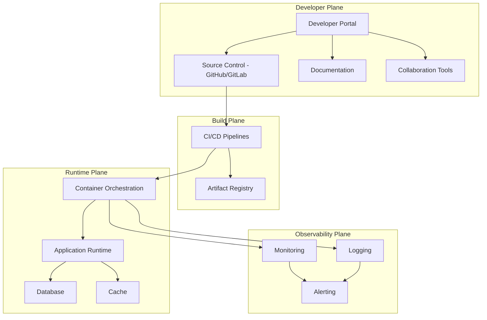

# Developer Plane

This document describes the Developer Plane, including tools, workflows, and environments provided to developers.

## Key Features

- Development environments
- Build and deployment tools
- Developer portals and documentation
- Collaboration and version control
- Testing and quality assurance
- Monitoring and feedback

