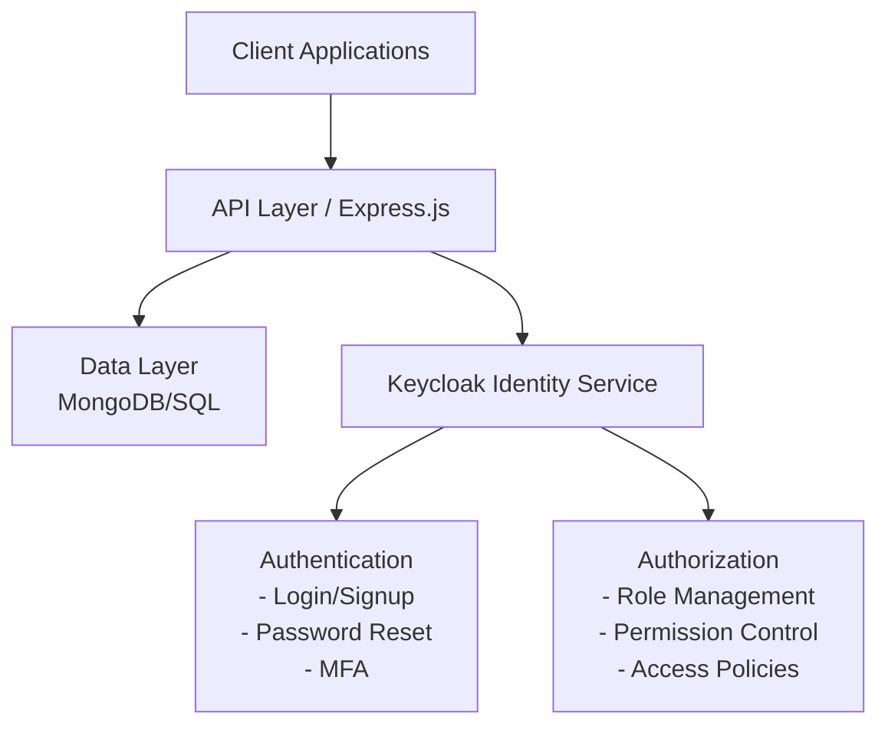

# User Identity & Authorization Management System Design Document

## 1. System Overview

This document outlines the design for a user identity and authorization management system for the Custom Build Platform, leveraging Keycloak as the core identity provider. The system provides secure user authentication, role-based access control, and session management, with integration to Node.js backend services.

## 2. Architecture

### 2.1 High-Level Architecture



### 2.2 Component Interactions

- **Client Applications**: Web/mobile frontends that use OAuth2/OIDC flows to authenticate via Keycloak
- **API Layer**: Express.js REST API that validates JWT tokens issued by Keycloak and enforces authorization
- **Keycloak Identity Service**: Manages user identities, authentication, roles, and permissions
- **Authentication**: Handled by Keycloak (login, signup, password reset, MFA)
- **Authorization**: Managed by Keycloak using roles and groups; API checks token claims for access control
- **Data Layer**: Stores application data; user data is managed by Keycloak

## 3. Data Models

> User, Role, Permission, and Session data are managed by Keycloak. Application-specific user profile extensions can be stored in your app database and linked via Keycloak user ID.

### 3.1 User Profile Extension Example

```javascript
{
  keycloakId: String,             // Reference to Keycloak user
  profile: {
    firstName: String,
    lastName: String,
    avatar: String,              // URL to avatar image
    phoneNumber: String,         // Optional
  },
  created: Date,
  lastLogin: Date,
  status: String                 // "active", "suspended", etc.
}
```

## 4. Authentication Flows

### 4.1 Registration & Login Flow (via Keycloak)

1. Client redirects user to Keycloak login/registration page (OIDC/OAuth2 flow)
2. User authenticates with Keycloak (supports password, social login, MFA, etc.)
3. Keycloak issues JWT access and refresh tokens
4. Client/API uses access token for authenticated requests
5. API validates token signature and claims

### 4.2 Password Reset & MFA

- Handled by Keycloak's built-in flows (email, TOTP, etc.)

## 5. Authorization Mechanisms

### 5.1 Role-Based Access Control (RBAC)

- Roles and groups are managed in Keycloak
- API endpoints validate user roles/permissions from JWT claims

### 5.2 Permission Checking Example

```javascript
const checkRole = (requiredRole) => {
  return (req, res, next) => {
    const roles = req.user?.roles || [];
    if (roles.includes(requiredRole)) {
      next();
    } else {
      res.status(403).json({ error: 'Permission denied' });
    }
  };
};

// Usage on routes
app.get('/api/admin/users', authenticate, checkRole('admin'), userController.listUsers);
```

### 5.3 JWT Structure (from Keycloak)

```javascript
{
  "sub": "user_id_123",
  "name": "John Doe",
  "email": "john@example.com",
  "preferred_username": "johndoe",
  "roles": ["user", "admin"],
  // ...other standard OIDC claims
}
```

## 6. API Endpoints

- API endpoints remain similar, but authentication and authorization are delegated to Keycloak. Use middleware to validate and decode Keycloak JWTs.

## 7. Security Considerations

- Rely on Keycloak for secure password storage, MFA, and token management
- Use HTTPS for all communications
- Validate JWTs using Keycloak's public keys
- Configure Keycloak security policies (password strength, brute force detection, etc.)

## 8. Technology Stack

- **Identity Provider**: Keycloak (Dockerized)
- **Backend Framework**: Express.js on Node.js
- **Database**: MongoDB or PostgreSQL for app data
- **Authentication**: OIDC/OAuth2 via Keycloak
- **Authorization**: Role-based, managed by Keycloak
- **Password Hashing, MFA, Email**: Handled by Keycloak

## 9. Implementation Guidelines

- Integrate Keycloak with your Node.js API using libraries like `keycloak-connect` or `express-oauth2-jwt-bearer`
- Store only application-specific user data in your app DB; use Keycloak for all identity management
- Use Keycloak admin console for managing users, roles, and groups

## 10. Testing Strategy

- Test OIDC/OAuth2 flows with Keycloak
- Test API endpoints with valid/invalid JWTs
- Test role-based access control via Keycloak roles

## 11. Deployment and Scaling

- Deploy Keycloak using Docker Compose or Kubernetes
- Use Keycloak's clustering and external DB for high availability

## 12. Future Enhancements

- Integrate with external IdPs (Google, Azure AD, etc.) via Keycloak
- Use Keycloak's fine-grained authorization features (policies, permissions)
- Implement advanced audit logging via Keycloak events

## Keycloak Features

Keycloak is a single sign on solution for web apps and RESTful web services. The goal of Keycloak is to make security simple so that it is easy for application developers to secure the apps and services they have deployed in their organization. Security features that developers normally have to write for themselves are provided out of the box and are easily tailorable to the individual requirements of your organization. Keycloak provides customizable user interfaces for login, registration, administration, and account management. You can also use Keycloak as an integration platform to hook it into existing LDAP and Active Directory servers. You can also delegate authentication to third party identity providers like Facebook and Google.

Keycloak provides a comprehensive set of features for authentication, authorization, and user management:

- **Single Sign-On (SSO):**
  - Users can log in once to access multiple applications without re-authenticating.
  - Supports SSO across web, mobile, and RESTful APIs.

- **Standard Protocols:**
  - Supports OAuth2, OpenID Connect (OIDC), and SAML 2.0 for secure authentication and authorization.

- **User Federation:**
  - Integrate with external user stores such as LDAP and Active Directory.
  - Synchronize users and groups from external sources.

- **Social Login:**
  - Out-of-the-box integration with social identity providers (Google, Facebook, GitHub, etc.).

- **User Management:**
  - Self-service registration, account management, and password reset.
  - Admin console for managing users, groups, roles, and permissions.

- **Role-Based Access Control (RBAC):**
  - Define roles and map them to users and groups.
  - Fine-grained authorization with policies and permissions.

- **Multi-Factor Authentication (MFA):**
  - Support for TOTP (Google Authenticator), SMS, and other MFA methods.
  - Configurable authentication flows.

- **Identity Brokering:**
  - Bridge authentication from external identity providers (enterprise or social).

- **Session Management:**
  - Centralized session management with support for session revocation and logout.

- **Custom Authentication Flows:**
  - Design custom authentication and authorization flows using a flexible flow engine.

- **User Consent and Account Linking:**
  - Users can link multiple identities and manage consent for applications.

- **Internationalization:**
  - Support for multiple languages and localization of login and account pages.

- **Admin and Account Consoles:**
  - Web-based interfaces for administrators and end-users to manage settings and accounts.

- **Extensibility:**
  - SPI (Service Provider Interfaces) for custom providers, authenticators, and event listeners.

- **Audit and Event Logging:**
  - Track authentication events, admin actions, and security events for compliance and monitoring.

- **Docker and Kubernetes Ready:**
  - Official images and Helm charts for easy deployment in containerized environments.

- **High Availability and Scalability:**
  - Clustering support and external database integration for production-grade deployments.
- **Docker and Kubernetes Ready:**
  - Official images and Helm charts for easy deployment in containerized environments.

- **High Availability and Scalability:**
  - Clustering support and external database integration for production-grade deployments.

For more details, see the [Keycloak documentation](https://www.keycloak.org/documentation).
